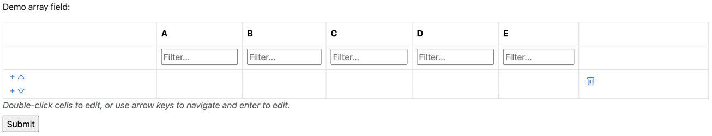

# datatables-django-widget

[DataTables](https://datatables.net/) is an excellent JS library for displaying tabular data, and its [Editor](https://editor.datatables.net/) plugin provides tabular editing.

We have encapsulated this into a Django widget, to allow easy editing of Postgres' [ArrayField](https://docs.djangoproject.com/en/5.1/ref/contrib/postgres/fields/#arrayfield).

The specific implementation, and feature-set, we have created for this widget may not suit your needs perfectly, but this repo may serve as a useful reference point for your own implementations.

Features:

- Inline editing
- Keyboard interface
- Column filtering
- Row insertion + deletion

## The demo project

This is a very minimal project, designed to be used as a complete working reference for how everything links together.

It's not pretty (except for the datatable itself!)

The `ArrayField` that the widget is designed to be used with is only available with a Postgres backend. This demo uses [Docker compose](https://docs.docker.com/compose/), to automatically install and set up a Postgres instance for you.

0. Install [Docker compose](https://docs.docker.com/compose/install/)

1. Clone this repo
```bash
git clone https://github.com/lqmltd/datatables-django-widget.git
```

2. Download the datatables files (see [this README](./app/static/grid-widget/datatables/README.md))
   1. You will need a [Datatables Editor license](https://editor.datatables.net/purchase/index) (a trial is available)

2. Build and start the Docker compose environment
```bash
docker compose up -d --build
```

3. Click "Create your first demo model"



The widget is the table, the surrounding form is ugly. We recommend using [Django crispy forms](https://django-crispy-forms.readthedocs.io/en/latest/) for form styling and layout.

## Using in your own project

You will need:

1. [Postgres](https://docs.djangoproject.com/en/5.2/ref/databases/#postgresql-notes) (required)
2. [Datatables](https://datatables.net/download/index) (required)
   1. See [this README](./app/static/grid-widget/datatables/README.md) for instructions on downloading your own bundle
   2. You will need a [Datatables Editor license](https://editor.datatables.net/purchase/index) (a trial is available)
3. [Bootstrap 5](https://getbootstrap.com/) (recommended)
   1. Datatables provides [styling for various other UI librarys](https://datatables.net/examples/styling/), but you will likely need to modify some of the code used here to make things look right
4. [Bootstrap icons](https://icons.getbootstrap.com/) (recommended)
   1. Any icon set will work, you will need to replace the icons used with your preferred library.

Files to copy:

1. [widgets.py](./app/utils/widgets.py)
2. [fields.py](./app/utils/fields.py)
3. [grid-widget.css](./app/static/grid-widget/grid-widget.css)
4. [grid-widget-text-area-plugin.js](./app/static/grid-widget/grid-widget-text-area-plugin.js)
5. [grid-widget.js](./app/static/grid-widget/grid-widget.js)
6. [project.css](./app/static/project.css) (incorporate this into your project's CSS files)

If you want tooltips:

7. [project.js](./app/static/project.js)

_If you don't, remove all calls to `initialiseTooltips()` and `disposeTooltips()`_
